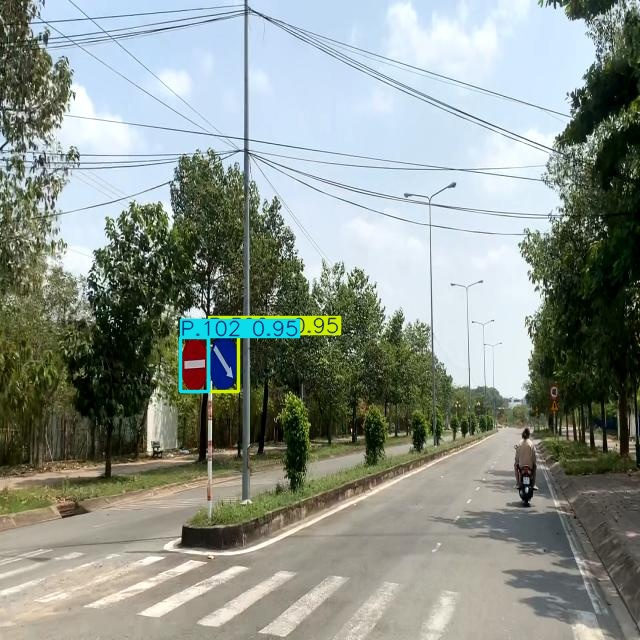
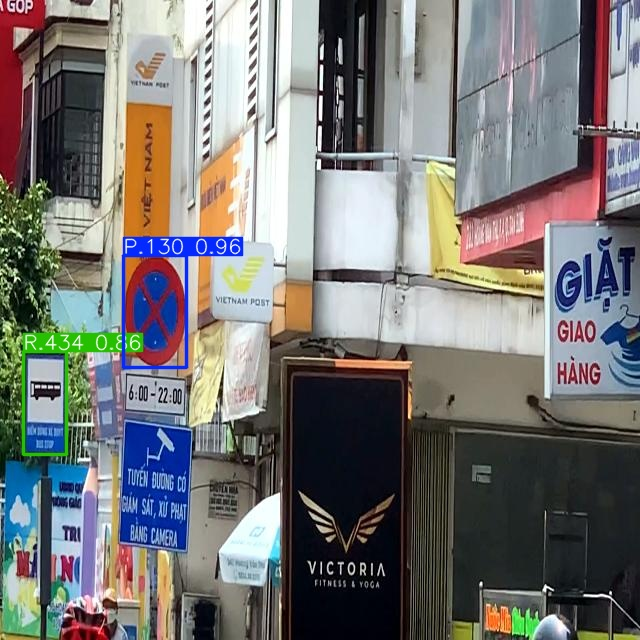
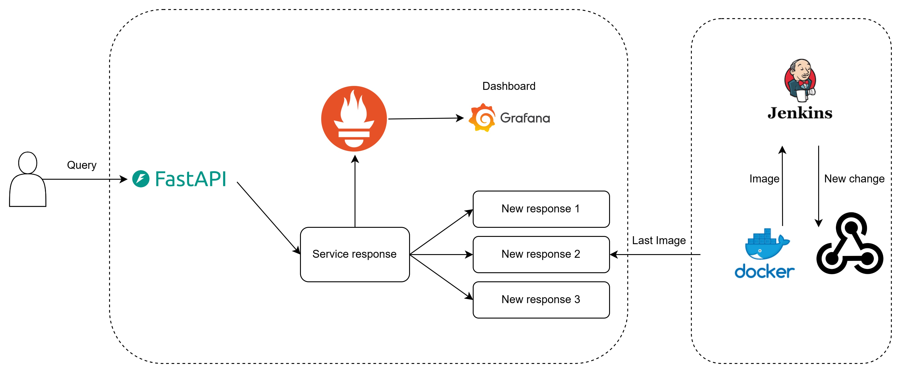

# Autonomous Vehicle
# Quick start

## 1. Create the new environment
Command prompt:

`conda create --name <env_name> python==3.11`

Run file `test.ipynb` in `src` folder. 

## 2. Background 

### 2.1 Traffic sign detection

I use YOLOv5 to train traffic sign detection tasks with the Roboflow custom dataset. YOLOv5 comes in various versions (e.g., YOLOv5s, YOLOv5m, YOLOv5l, YOLOv5x) with varying complexity and accuracy. 

Roboflow data link: https://universe.roboflow.com/vietnam-traffic-sign-detection/vietnam-traffic-sign-detection-2i2j8/dataset/6

**Note**: I use the Roboflow dataset as the main method of traffic sign detection and the Kaggle dataset as a test file.

### 2.2 Result 

 

**Loss**:

**train/box_loss, train/cls_loss, train/dfl_loss**: These loss metrics decrease consistently during training, indicating that the model is learning to predict bounding box locations, classify objects, and estimate distances more accurately.
val/box_loss, val/cls_loss, val/dfl_loss: The validation losses also decrease, suggesting that the model is not overfitting (memorizing the training data). However, there is some fluctuation in the later epochs, possibly due to a small validation set or randomness in the training process.

**Precision and Recall**:

**metrics/precision(B)**: Precision increases over time, showing that the model is making more accurate bounding box predictions.

**metrics/recall(B)**: Recall also increases, indicating that the model is detecting more objects overall.

**mAP (mean Average Precision)**:

**metrics/mAP50(B)**: mAP@0.5 (mean average precision with an IoU threshold of 0.5) increases and reaches a good value (around 0.8), demonstrating the model's strong object detection capabilities.

**metrics/mAP50-95(B)**: mAP@0.5:0.95 (mean average precision across IoU thresholds from 0.5 to 0.95) also increases, but its value is lower than mAP@0.5, suggesting that the model still struggles to predict very precise bounding boxes with high IoU.

  
  
  

## 3. Future work

### 3.1 Motion detection

1. **Motion Estimation from Disparity Maps:** 

   * **Research Focus:** Investigate how to directly estimate object motion vectors from the disparity maps generated by STTR. This can involve developing algorithms that analyze changes in disparity over time to infer the velocity and direction of objects.

2. **Integration with Optical Flow:**

   * **Research Focus:** Explore combining optical flow algorithms with STTR-generated disparity maps to create a more robust and accurate motion detection system. This could involve fusing information from both sources to improve the detection of small, fast-moving objects or handle challenging scenarios like occlusions.

3. **Real-time Optimization:** 

   * **Research Focus:** Optimize the STTR model and overall pipeline for real-time performance on embedded hardware in vehicles. This could involve techniques like model quantization, pruning, or hardware acceleration to reduce latency and computational demands.

4. **Object Classification and Tracking:**

   * **Research Focus:** Extend the capabilities of the stereo vision system to include object classification and tracking. This would allow the system to detect motion and identify the types of objects (e.g., pedestrians, vehicles, cyclists) and track their movement over time.

5. **Behavior Prediction:**

   * **Research Focus:** Develop methods to predict the future trajectories and behavior of detected objects. This information could be used to anticipate potential collisions or dangerous situations and trigger appropriate warnings or interventions.

6. **Multi-Sensor Fusion:**

   * **Research Focus:** Combine stereo vision with other sensors like LiDAR and radar to create a multi-modal perception system for even more robust and reliable motion detection in diverse driving scenarios.

7. **Evaluation in Real-World Scenarios:**

   * **Research Focus:**  Conduct extensive testing and validation of the motion detection system in various real-world driving conditions (e.g., different lighting, weather, traffic). This would help identify limitations and potential areas for improvement.

### 3.2 ML workflow

1. **Data Collection and Storage:**
   
   - **Source:** Raw data is gathered from various sensors on the autonomous vehicle (cameras, LiDAR, radar, GPS, IMU, etc.).
     
   - **Storage:** Raw data is stored in a scalable and durable object storage service like AWS S3 (Simple Storage Service).

2. **Data Preprocessing:**
   - **Processing:** The raw data is preprocessed using a distributed processing framework like AWS EMR (Elastic MapReduce). This step involves cleaning, synchronization, normalization, and labeling (if necessary) to prepare the data for model training.
     
   - **Storage:** Preprocessed data is stored back in S3 for easy access during training.

3. **Model Development:**
   - **Training:** The YOLOv5 object detection model is trained using the preprocessed data. This could be done on powerful GPU instances in AWS EC2 (Elastic Compute Cloud) or using a managed service like AWS SageMaker.
     
   - **Experiment Tracking:** MLflow is used to track experiments, log hyperparameters, metrics, and model artifacts. This helps you compare different model versions and reproduce results.
     
   - **Model Registry:** The best performing model is registered in the MLflow Model Registry for versioning and deployment.

4. **Packaging and Deployment:**
   - **Containerization:** The trained model, along with its dependencies, is packaged into a Docker image.
     
   - **Image Registry:** The Docker image is stored in a container registry like AWS ECR (Elastic Container Registry).
     
   - **Orchestration:** Kubernetes (K8s), either self-managed or using a managed service like AWS EKS (Elastic Kubernetes Service), is used to orchestrate the deployment of the model as a microservice. This ensures scalability, fault tolerance, and efficient resource utilization.

5. **API Endpoint (FastAPI):**
   - **Deployment:** A FastAPI service is created to expose the model's prediction capabilities as a RESTful API. This API allows other components of the autonomous vehicle system to request object detections from the model.
     
   - **Integration:** The FastAPI service is integrated into the Kubernetes cluster.

6. **Visualization (Optional):**
   - **Gradio/Streamlit:** You can optionally create a user interface using Gradio or Streamlit to visualize the model's predictions in real time. This UI can be deployed as another microservice in the Kubernetes cluster.

7. **CI/CD (Jenkins):**

   - **Automation:** Jenkins is used to automate the continuous integration and continuous deployment (CI/CD) pipeline. This ensures that new model versions or code changes are automatically tested, built, and deployed to the production environment.

8. **Monitoring (Grafana/Prometheus):**
   
   - **Deployment:** Prometheus is used to collect metrics from the application and model, and Grafana is used to visualize these metrics in a user-friendly dashboard.
     
   - **Monitoring:** The dashboard provides insights into model performance, resource utilization, and overall system health, allowing you to proactively identify and address issues.

**Data Flow:**

1. Sensor Data -> AWS S3
2. AWS S3 -> AWS EMR (Preprocessing) -> AWS S3
3. AWS S3 -> AWS SageMaker (Model Training) -> MLflow Model Registry
4. MLflow Model Registry -> Docker Images -> AWS ECR
5. AWS ECR -> Kubernetes (EKS) (Microservice Deployment)
6. Microservices (Object Detection) -> FastAPI -> Gradio/Streamlit (UI)

**Additional Tools (Optional):**

* **Terraform:** For infrastructure as code (IaC) to automate the provisioning and management of AWS resources.
* **AWS CloudWatch:** For additional logging and monitoring capabilities.
